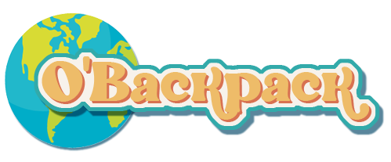

# Welcome on board

## Table of Contents
- [O'backpack](#Obackpack)
  - [Table of Contents](#table-of-contents)
    - [General Info](#general-info)
    - [Screenshot](#screenshot)
  - [Technologies](#technologies)
  - [Project status](#project-status)
  
### General Info
***

O'backpack est un projet permettant aux personnes voyageant en sac à dos de trouver des infos utiles sur leurs futures destinations, mais aussi et pourquoi pas des bons plans et/ou d'autres compagnons de routes...

Un projet réalisé par par Céline, Clélia, Viviane et Samia.

### Screenshot

## Technologies
***
Main technologies and libraries
* [Symfony](https://symfony.com/): Version 5.3 
* [Mercure](https://mercure.rocks/)
  

## Project status

The project is currently on hold.
For view the project go to take a look on the presentation on [Youtube](https://www.youtube.com/watch?v=1qlGlKTmlxk&t=2632s)

